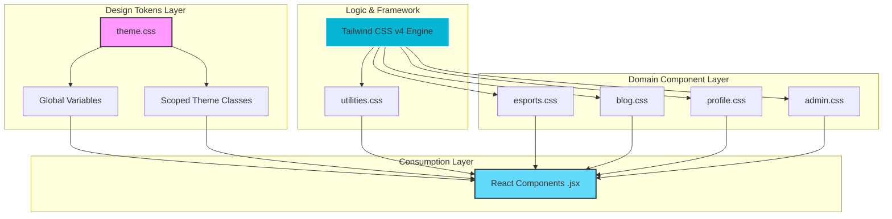
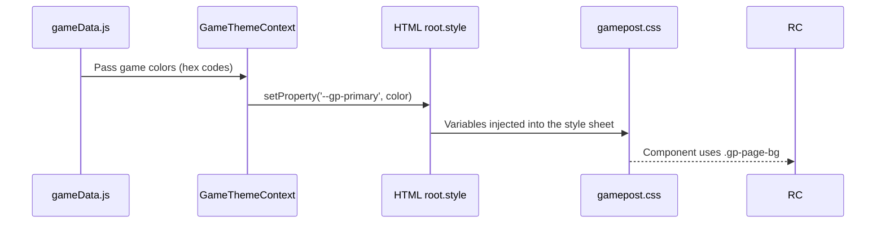

# 🏰 GzoneSphere CSS Architecture & Design System

This document outlines the systematic approach used to maintain, scale, and theme the GzoneSphere frontend codebase. We employ a **Hybrid Styling Architecture** combining the foundational power of **CSS Custom Properties (Variables)** with the speed and utility of **Tailwind CSS v4**.

---

## 🏛️ 1. High-Level Architecture Flow

The following diagram represents how styling is composed and consumed across the application:

---

## 📁 2. File Roles & Descriptions

Every file in `src/styles/` has a predefined purpose. Adhering to these roles prevents "CSS Sprawl" and simplifies maintenance.

| File / Folder | Role | Characteristics |
| :--- | :--- | :--- |
| **`theme.css`** | **Foundational** | The **Source of Truth**. Defines all Design Tokens (Colors, Shadows, Radii). No layout logic. |
| **`index.css`** | **Integration** | The **Entry Point**. Imports Tailwind base and all modular CSS files in order. |
| **`utilities.css`**| **Helper** | Global layout utilities that extend Tailwind. Example: `.container-global`, `.scrollbar-hide`. |
| **`esports.css`** | **Feature Library** | Semantic components for Esports (`.es-card`, `.es-btn-primary`). Uses `@apply`. |
| **`blog.css`** | **Feature Library** | Semantic components for the Blog system (`.bl-label`, `.bl-post-card`). |
| **`profile.css`** | **Feature Library** | Components for User Dashboard and Settings (`.pr-input`, `.pr-btn-danger`). |
| **`auth.css`** | **Feature Library** | Shared components for Login and Registration flows (`.auth-card`). |
| **`admin/`** | **Scoped Module** | Fragmented styles for the admin dashboard components (Tables, Forms, Nav). |
| **`gamepost.css`** | **Structural** | Animations and base layouts for dynamic Game Posts. |

---

## 🎨 3. Theming Mechanism

We support two distinct types of theming: **Static** (Standard Sections) and **Dynamic** (Per-Game Sections).

### 3.1 Static Theming (Namespace Scoping)
Standard sections use specific classes fixed on the page container. Variables are defined globally but scoped to these classes in `theme.css`.

- **Example**: `
`
- **Logic**: Tailwind utilities like `text-[var(--theme-primary)]` will resolve to the values defined under `.theme-esports` in `theme.css`.

### 3.2 Dynamic Theming (JS-Driven Context)
Game Posts require runtime colors based on the game's identity. This is handled by a direct connection between React and the DOM.

---

## 🏷️ 4. Naming Convention (Namespacing)

To avoid collisions and make the intent obvious, we use specific prefixes for different domains:

- **`.es-*`** : Esports (Tournaments, Home)
- **`.bl-*`** : Blog (Feed, Post, Creative Panels)
- **`.pr-*`** : Profile (User Dashboard, Subscriptions)
- **`.auth-*`**: Auth (Login, Register)
- **`.admin-*`**: Admin Panel (Inventory, Users, Tables)
- **`.gp-*`** : Game Post (Dynamic structural styles)

---

## 🛠️ 5. Development Rules

### Rule 1: Literal Colors are "Illegal" 🚫
Never hardcode hex codes or standard Tailwind colors (e.g., `text-blue-500`) in UI components. 
*   **Wrong**: `className="text-white bg-[#FF5500]"`
*   **Correct**: `className="text-[var(--theme-text-inverse)] bg-[var(--theme-primary)]"`

### Rule 2: Layout Belongs to Tailwind 📐
Use Tailwind utility classes for the foundation of every element.
*   **Use Utilities for**: `flex`, `grid`, `margins`, `padding`, `gap`, `aspect-ratio`.
*   **Use @apply for**: Complex, reusable UI units (Buttons, Input Fields, Domain Cards).

### Rule 3: Responsive Visibility 📱
Always use Tailwind's responsive prefixes (`md:`, `lg:`) instead of media queries in plain CSS files unless the logic is extremely complex (e.g., custom SVG path animations).

### Rule 4: Variable Naming 📝
All globally themed variables must follow the `--theme-{property}-{variant}` pattern.
- Correct: `--theme-bg-alt`, `--theme-text-muted`.
- Wrong: `--primary-color`, `--dark-bg`.
